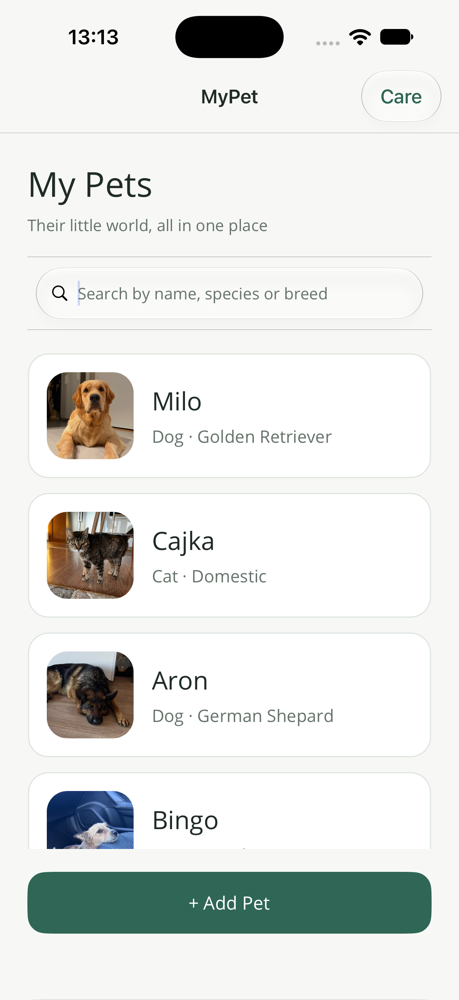
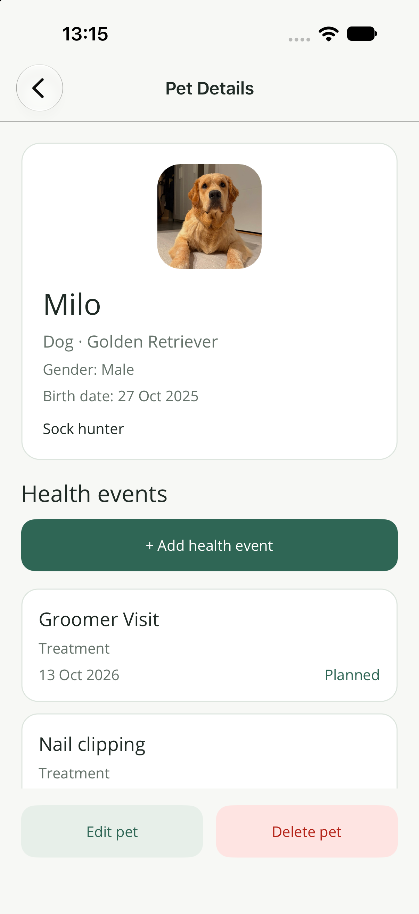
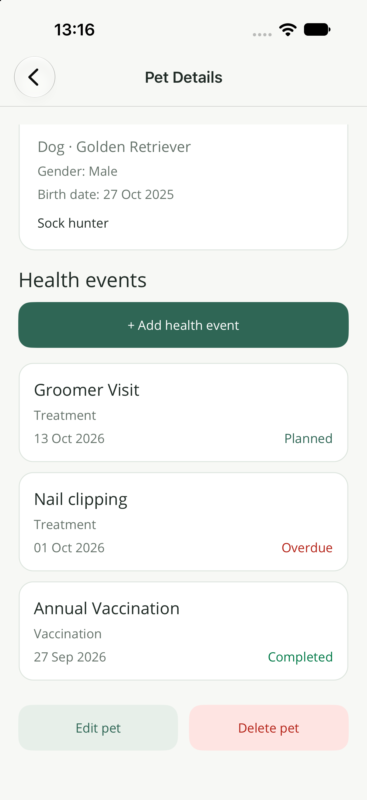

MyPet
MyPet is a simple pet care tracker built with C# and .NET MAUI.
The app is designed for keeping basic pet information and health-related events in one place, with all data stored locally on the device.
Features
- Add, view, edit and delete pets
- Store name, species, breed, gender, date of birth and notes
- Add, replace and remove pet photos
- Search pets by name, species or breed
- Add health events such as:
    - Vaccinations
    - Vet visits
    - Treatments
- Track event status as Planned, Completed or Overdue
- Care overview with filters by pet and status
- Local SQLite storage
- Data and photos remain saved after restarting the app
- Related health events are removed when a pet is deleted
- Runs on both Android and iOS
  MyPet is currently a local, single-user application, so no account or login is required.
  Screenshots
### My Pets

### Pet Details

### Care Overview

Technologies
- C#
- .NET 10
- .NET MAUI
- XAML
- SQLite
- sqlite-net-pcl
- JetBrains Rider
- Android Emulator
- iOS Simulator / Xcode
  Running the project
  Requirements
  You need:
- .NET 10 SDK
- .NET MAUI workloads
- Android SDK for Android development
- Xcode and an iOS Simulator for iOS development on macOS
  Clone the repository:
  git clone https://github.com/DamirBosnjak/MyPet.git
  cd MyPet
  Restore the project:
  dotnet restore MyPet/MyPet.csproj
  Build for Android:
  dotnet build MyPet/MyPet.csproj -f net10.0-android
  Build for iOS Simulator:
  dotnet build MyPet/MyPet.csproj -f net10.0-ios -r iossimulator-arm64
  The project can also be opened in JetBrains Rider and started by selecting an Android emulator or iPhone simulator and pressing Run.
  Project structure
  MyPet/
  ├── Models/       # Data models used by the application
  ├── Services/     # SQLite and photo handling
  ├── Views/        # Application pages
  ├── Resources/    # Icons, styles and app resources
  ├── Platforms/    # Android and iOS platform-specific files
  └── MauiProgram.cs
  Notes
  All application data is stored locally using SQLite.
  The Android and iOS versions therefore have separate local databases on their respective emulator or device.